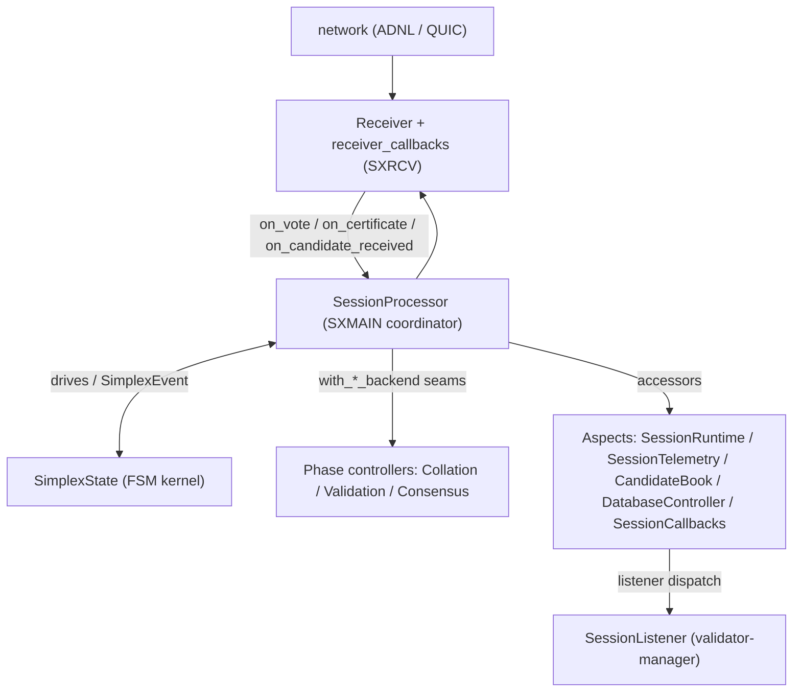

# Simplex Consensus Protocol

**Version 1.0.0** (June 16, 2026) — [Changelog](CHANGELOG.md)

Rust implementation of the [Simplex](https://github.com/ton-blockchain/simplex-docs)
consensus protocol ("Catchain 2.0") for the TON blockchain. It is wire-compatible
with the upstream C++ implementation and runs in mixed Rust/C++ validator networks.

| Reference | Location |
|---|---|
| Protocol specification | [ton-blockchain/simplex-docs](https://github.com/ton-blockchain/simplex-docs) (`Simplex.md`) |
| C++ parity baseline | [ton-blockchain/ton](https://github.com/ton-blockchain/ton) (`testnet/validator/consensus/simplex`) |
| Release history | [CHANGELOG.md](CHANGELOG.md) |
| API reference | crate rustdoc — `cargo doc -p simplex --open` |

## Key semantics

- **Finalized-driven delivery.** Finalized blocks are delivered through
  `SessionListener::on_block_finalized()` and may arrive out of order. The
  legacy sequential `on_block_committed()` callback is part of the shared
  listener interface but is never used by Simplex.
- **Deferred body materialization.** A finalized block can be known before its
  body arrives locally; it is held in `finalized_pending_body` and materialized
  once the body is received.
- **Create / start separation.** `create_session()` builds the session;
  `start(prev_blocks, min_masterchain_block_id)` begins consensus and derives
  `initial_block_seqno = max(prev_blocks[].seq_no) + 1` (a shard merge picks the
  higher parent).
- **Restart is state restoration only.** Startup replays persisted skip / final
  certificates and repairs the progress cursor before accepting live ingress;
  there are no historical replay callbacks.
- **State-resolver bridge.** `SimplexSession::ensure_candidate_available()`
  drives resolver-led repair, and every observed candidate is forwarded via
  `SessionListener::on_candidate_observed()` so the validator-side
  `StateResolverCache` can serve collation/validation without a finalized parent.
- **Durability before action.** Certificates and SYNC-CRITICAL pool state are
  persisted before any state transition or network side effect, and the persists
  run off the SXMAIN consensus thread (async-DB registry).
- **DoS hardening.** Peers that send bad vote/cert signatures are banned for
  `bad_signature_ban_duration` (mirrors C++ `pool.cpp::ban`).
- **Observability.** Per-session metrics are republished to the global Prometheus
  recorder (see [Telemetry and health checks](#telemetry-and-health-checks)).
- **Optional block-sync overlay.** Candidate propagation can move to a dedicated
  overlay via `SessionOptions::enable_observers` (ConfigParam 30, default off,
  C++ #2380 parity).

## Overview

Simplex is a consensus protocol with TON-specific implementation choices:

- **Conservative path only** — no fast-finality / optimistic path.
- **Fault tolerance** — safe and live with `< 1/3` Byzantine weight.
- **Quorum** — certificates require `2/3` stake weight (see [Thresholds](#thresholds)).
- **Three vote types** — Notarize, Finalize, Skip; no fallback votes.
- **No erasure coding** — candidates use two-step FEC broadcast, votes and
  certificates are sent per peer (no Rotor-style shreds).

### Key design decisions

1. **Conservative consensus path** — reliability over latency.
2. **Ed25519 signatures** — individual signatures, no BLS aggregation.
3. **Actor model** — separate threads for consensus, callbacks, and network.
4. **Task queues** — cross-thread communication via closures.

### Protocol mapping (spec rule -> C++ -> Rust)

This mirrors the spec's "Concept-to-Code Map" (`Simplex.md` §4.1), with the Rust
counterparts in this crate. The FSM kernel lives in
[`src/simplex_state.rs`](src/simplex_state.rs); the per-phase orchestration lives
in the controllers (see [Architecture](#architecture)).

| Spec concept | C++ (`validator/consensus/simplex`) | Rust |
|---|---|---|
| Frontier `F_v` (Rule 1) | `PoolImpl::advance_present` (`pool.cpp`) | `simplex_state.rs::advance_progress_cursor` |
| Candidate resolution (Rule 2) | `CandidateResolverImpl` (`candidate-resolver.cpp`) | `receiver.rs` candidate-resolver flow |
| Leader duty (Rule 3) | `BlockProducerImpl::generate_candidates` | `collation_controller.rs::invoke_collation` |
| Notarize (Rule 4) | `ConsensusImpl::try_notarize` (`consensus.cpp`) | `simplex_state.rs::try_notar` |
| Finalize (Rule 5) | `ConsensusImpl::try_vote_final` (`consensus.cpp`) | `simplex_state.rs::try_final` |
| Skip (Rule 6) | `ConsensusImpl::alarm` (`consensus.cpp`) | `simplex_state.rs::process_timeouts`, `try_skip_window` |
| Cert formation / rebroadcast (Rule 7) | `PoolImpl::handle_vote` / `handle_our_certificate` | `simplex_state.rs::set_{notarize,finalize,skip}_certificate` |
| Standstill (Rule 8) | `PoolImpl::alarm` (`pool.cpp`) | `receiver.rs::reschedule_standstill`, `check_standstill` |
| Leader-window publish | `PoolImpl::maybe_publish_new_leader_windows` | `simplex_state.rs::advance_leader_window_on_progress_cursor` |

### Relationship to other components

```text
validator-manager (higher level)
        │  SessionListener callbacks
        ▼
    simplex  ◄── this crate
        │  imports shared types from
        ▼
consensus-common (Session/listener traits, overlay interfaces, compression)
        │  runs over
        ▼
overlay / ADNL / QUIC (lower level, network)
```

## Rust vs C++ reference: known differences

This crate targets wire-compatibility with the upstream **C++ Simplex** implementation in [ton-blockchain/ton](https://github.com/ton-blockchain/ton) (`testnet/validator/consensus/simplex`).

### Protocol parity gaps (from C++ upstream)

- External-aware collation pipeline — callback-driven external wait loop. **MEDIUM**
- Block-sync overlay (C++ #2380 / #2382) — opt-in via `SessionOptions::enable_observers`; the simplex receiver already drops candidate broadcasts on the consensus overlay and computes the block-sync overlay short id (`compute_block_sync_overlay_short_id`), but the full dedicated-overlay candidate distribution is still being rolled out. **MEDIUM**
- DB-CERT-INDEX follow-up: secondary index for `SimplexDb` cert lookups by `candidate_id` / `slot` to keep `load_*_by_id` / `load_skip_cert_by_slot` O(1) after the cert-storage consolidation. **MEDIUM**

### Implementation parity gaps

- C++ has `ImprovedStructureLZ4WithState` (BOC compression algo 2) — Rust only supports algos 0 and 1.
- C++ has `StoreCellHint` for DB commit optimization during MerkleUpdate apply — Rust lacks equivalent.
- C++ overlay manager can buffer messages for unknown overlays (disabled by default) — Rust lacks equivalent.

### Resolved parity work

The full history of resolved C++ parity items — finalized-driven delivery,
certificate-order durability, the bootstrap-deadlock fixes, the ghost-parent
state resolver, DoS hardening, async-DB persistence, restart-recovery base
repair, two-step FEC broadcast, QUIC transport, and more — is recorded in the
[CHANGELOG](CHANGELOG.md).

## Architecture

### Threading Model

```
┌────────────────────────────────────────────────────────────────────────────────┐
│ Simplex Session                                                                │
│                                                                                │
│  ┌────────────────────────────────────┐   ┌──────────────────────────────────┐ │
│  │ Main Thread (SXMAIN:{session_id})  │   │ Callback Thread (SXCB:...)       │ │
│  │                                    │   │ (if use_callback_thread=true)    │ │
│  │  ┌──────────────────────────────┐  │   │                                  │ │
│  │  │ SessionProcessor             │  │   │  - pull callback queue           │ │
│  │  │  - consensus FSM             │  │   │  - invoke SessionListener:       │ │
│  │  │  - slot state management     │  │   │    - on_candidate                │ │
│  │  │  - vote tracking             │  │   │    - on_block_finalized          │ │
│  │  └──────────────────────────────┘  │   │    - on_generate_slot            │ │
│  │                                    │   └──────────────────────────────────┘ │
│  │  - pull main task queue            │                                        │
│  │  - check_all() on awake            │                                        │
│  │  - metrics dump (30s)              │                                        │
│  └────────────────────────────────────┘                                        │
│                         ▲                                                      │
│                         │ ReceiverListener callbacks                           │
│                         │                                                      │
│  ┌─────────────────────────────────────────────────────────────────────────┐   │
│  │ Receiver Thread (SXRCV:{session_id})                                    │   │
│  │                                                                         │   │
│  │  - deserialize incoming TL messages                                     │   │
│  │  - verify signatures, deduplicate                                       │   │
│  │  - post to main queue via ReceiverListener                              │   │
│  │  - serialize and send outgoing votes/broadcasts                         │   │
│  │  - metrics dump (30s), shuffle send order (10s)                         │   │
│  └─────────────────────────────────────────────────────────────────────────┘   │
│                         │                                                      │
│                         │ ConsensusOverlay                                     │
│                         ▼                                                      │
│  ┌─────────────────────────────────────────────────────────────────────────┐   │
│  │ ConsensusOverlayManager (from consensus-common)                         │   │
│  └─────────────────────────────────────────────────────────────────────────┘   │
└────────────────────────────────────────────────────────────────────────────────┘
```

### Data flow

```text
Incoming                                            Outgoing
   │                                                   ▲
   ▼                                                   │
Receiver (SXRCV thread)                      send vote / broadcast / cert
   - deserialize TL (vote / candidate / certificate)
   - verify signatures, deduplicate, drop banned peers
   - post a closure to the SXMAIN main queue
   │  ReceiverListener
   ▼
SessionProcessor (SXMAIN coordinator)
   - drive SimplexState: votes/candidates in -> SimplexEvents out
   - route events to phase controllers (Collation / Validation / Consensus)
   - persist via the async-DB registry, then broadcast votes/certs
   │  SessionCallbacks (SXCB thread when use_callback_thread)
   ▼
SessionListener (implemented by validator-manager)
   - on_candidate          validate a candidate
   - on_generate_slot      produce a block when leader
   - on_block_finalized    receive a finalized block (may be out of order)
   - on_candidate_observed  feed the validator-side StateResolverCache
```

### Component architecture

`SessionProcessor` owns no consensus *policy*: it drives the main loop and routes
[`SimplexState`](src/simplex_state.rs) (the deterministic FSM kernel) events to
focused controllers and aspects.



See [Components](#components) for what each controller and aspect owns.

## Key Concepts

### Leader Windows

Slots are grouped into **leader windows**. One leader is responsible for all slots in a window:
- Window index: `slot / slots_per_leader_window`
- Leader selection: round-robin by window index
- First slot in window can build on any notarized block
- Subsequent slots must build on previous slot's voted block

### Vote Types

| Vote | On Wire | Purpose |
|------|---------|---------|
| `NotarizeVote` | ✅ | Vote to notarize a block in a slot |
| `FinalizeVote` | ✅ | Vote to finalize after notarization |
| `SkipVote` | ✅ | Skip a slot (timeout or no valid block) |

### Certificates

When 2/3 stake weight is reached for a vote type, a certificate is formed:
- **NotarizationCert**: Block is notarized
- **FinalizationCert**: Block is finalized
- **SkipCert**: Slot is skipped

Certificates are implicit (derived from vote counts), not explicit on-wire objects.

### Empty Blocks (TON-Specific Extension)

Empty blocks are a **finalization recovery** mechanism not in the original protocol paper:

**Purpose**: When consensus gets ahead of finalization (no FinalizeCertificates), empty blocks
let validators re-vote on the previous block to attempt getting a FinalizeCertificate.

**When generated** (`should_generate_empty_block()`, matching `Simplex.md` §4.4):
- **Masterchain**: when the next block would be more than one seqno ahead of the
  last finalized block (`last_finalized_seqno + 1 < new_seqno`).
- **Shardchain**: when the masterchain's last finalized seqno falls more than
  `empty_block_mc_lag_threshold` (8 by default) blocks behind the shard tip
  (`last_mc_finalized_seqno + threshold < new_seqno`).

**Key invariants**:
- First block in epoch **cannot** be empty (must have actual data)
- Empty block **must** have parent (inherits parent's `BlockIdExt`)
- Empty blocks use `consensus.empty` TL variant (not `consensus.block`)

**Implementation** (in [`src/collation_controller.rs`](src/collation_controller.rs)):
- `CollationResult` enum: `Block(candidate)` or `Empty { parent_block_id }`
- `GeneratedBlockDesc`: common data for both empty and normal blocks
- `create_normal_block_desc()` / `create_empty_block_desc()`: prepare block data

### Thresholds

Stake-weighted quorum matching the spec's `q = floor(2W/3) + 1` (`Simplex.md`
§1.1). Implemented in [`src/utils.rs`](src/utils.rs) with integer division:

| Threshold | Value | Purpose |
|---|---|---|
| 2/3 quorum | `(total * 2) / 3 + 1` | Certificate quorum (`threshold_66`) |
| 1/3 | `total / 3 + 1` | Strict 1/3 for safety conditions (`threshold_33`) |

### Consensus Loop

Each slot follows this flow:

```
Collate → Broadcast → Validate → Notarize → Vote → Collect → Finalize → Deliver → next slot
```

| Phase | Controller / FSM kernel method | Output |
|---|---|---|
| **Collate** | `CollationController::check_collation` -> `invoke_collation` | Block candidate |
| **Broadcast** | `CollationController::generated_block` -> `Receiver::send_block_broadcast` | Block to network |
| **Validate** | `ValidationController::check_validation` -> `SessionCallbacks::notify_candidate` | Validation request |
| **Notarize** | `SimplexState::on_candidate` -> `try_notar` | `BroadcastVote(Notar)` |
| **Vote** | `SessionProcessor::broadcast_vote` | Vote to network |
| **Collect** | `SimplexState::on_vote` -> thresholds | Threshold events |
| **Finalize** | `SimplexState::try_final` | `BroadcastVote(Final)` |
| **Deliver** | `ConsensusController::handle_block_finalized` | `on_block_finalized()` |

## Package Structure

All `src/` modules except `utils` (and the `ton` TL re-export in `lib.rs`) are
crate-private; the public surface is `lib.rs` + `utils`.

```text
node/simplex/
├── Cargo.toml                  # Package manifest
├── README.md                   # This file
├── CHANGELOG.md                # Release notes (this crate)
├── src/
│   ├── lib.rs                  # Public API: SessionFactory, SessionOptions, SimplexSession, ...; re-exports, utils + ton modules
│   │
│   ├── simplex_state.rs        # Consensus kernel: deterministic FSM (votes/candidates in -> SimplexEvents out)
│   │
│   ├── session.rs              # Session wrapper: SXMAIN/SXCB threads, task queues, lifecycle
│   ├── session_processor.rs    # SXMAIN coordinator: main loop, FSM event routing
│   ├── collation_controller.rs # Phase controller: collation, precollation, empty-block recovery
│   ├── validation_controller.rs# Phase controller: candidate-validation pipeline
│   ├── consensus_controller.rs # Phase controller: vote/cert ingress+egress, finalization, MC top
│   ├── controller_queue.rs     # Re-entrancy-safe task-posting seam for controllers
│   │
│   ├── session_runtime.rs      # Aspect: runtime context (slot map, scheduler, bootstrap handles)
│   ├── session_callbacks.rs    # Aspect: SessionListener dispatch (SXCB)
│   ├── session_telemetry.rs    # Aspect: metrics + structured stall diagnostics
│   ├── session_description.rs  # Aspect: immutable validator set, thresholds, leader schedule
│   ├── candidate_book.rs       # Aspect: in-memory received-candidate + data caches
│   ├── database_controller.rs  # Aspect: async-DB write registry + DB handle
│   │
│   ├── receiver.rs             # Network I/O (SXRCV): dedup, standstill, candidate resolver, peer-ban
│   ├── receiver_callbacks.rs   # SXRCV -> SXMAIN adapter (ReceiverListener)
│   │
│   ├── database.rs             # RocksDB schema (unified db.key.vote + db.cert) + bootstrap
│   ├── startup_recovery.rs     # Startup state restoration: skip/final-cert + vote replay
│   ├── certificate.rs          # Certificate<T>, VoteSignature, voteSignatureSet
│   ├── block.rs                # Candidate types + index newtypes (SlotIndex/WindowIndex/ValidatorIndex)
│   ├── misbehavior.rs          # Conflicting-vote proofs and reports
│   ├── prometheus_publisher.rs # Republish per-session metrics to the global Prometheus recorder
│   ├── task_queue.rs           # Task queue traits and types
│   ├── utils.rs                # Public module: crypto, hashes, thresholds
│   └── tests/                  # Crate-private unit tests (20 modules)
└── tests/                      # Public-API integration tests
    ├── test_collation.rs       # Single-node collation
    ├── test_consensus.rs       # Multi-instance consensus (13 tests)
    ├── test_restart.rs         # Restart recovery
    └── test_validation.rs      # Two-node validation
```

## Components

### Public API (`lib.rs`)

Integration entry point. Run `cargo doc -p simplex --open` for the full API
reference. The crate also re-exports the `consensus-common` types that appear in
its signatures (listener trait, payload pointers, overlay manager, key types).

| Type | Purpose |
|------|---------|
| `SessionFactory` | Create sessions and overlay managers |
| `SessionOptions` | Per-session configuration |
| `PrometheusLabels` | Metric label-cardinality strategy |
| `SimplexSession` | Simplex session trait (extends `ConsensusSession`) |
| `SessionPtr` / `SessionListenerPtr` | Session and listener pointer aliases |
| `RawVoteData` | Shared serialized-vote buffer |
| `ConsensusSession` | Base session trait (re-export of `consensus_common::Session`) |
| `SessionListener` | Validator callback trait (re-export from `consensus-common`) |
| `SessionNode` | Validator node descriptor (re-export) |
| `utils` | Public module of crypto / hash / threshold helpers |

**SimplexSession Trait** (MC finalization notification + state-resolver bridge):

```rust
pub trait SimplexSession: ConsensusSession {
    /// Notify session about accepted MC top (for shard empty block decisions).
    fn notify_mc_finalized(&self, applied_top: BlockIdExt);

    /// Resolver-driven repair entry point. Posts to the main task queue so
    /// the body / parent chain can be requested without blocking the
    /// validator side. Used by `StateResolverCache::request_availability`
    /// when collation/validation needs a parent state that's not yet in
    /// the cache or applied by the engine.
    fn ensure_candidate_available(
        &self,
        block_id: BlockIdExt,
        opts: EnsureCandidateAvailabilityOptions,
    );
}
```

This separate trait allows simplex-specific operations without modifying the shared `ConsensusSession` trait
from validator-session. For shard chains, the higher layer (ValidatorManager) should call
`notify_mc_finalized()` with the accepted MC top `BlockIdExt` when masterchain blocks are finalized to enable empty block generation. `ensure_candidate_available()` is called by the validator-side resolver cache and forwarded into Simplex via the main task queue.

**Listener side**: the simplex `SessionProcessor` calls
`SessionListener::on_candidate_observed(block_id, data, collated_data, flags)`
(in `consensus-common`) on every observed candidate. The validator wires
this into `StateResolverCache::upsert_observed_candidate` so the cache
can serve future collation/validation without re-querying peers.

### Session wrapper (`session.rs`)

Multi-threaded wrapper around the coordinator:
- Main loop thread (`SXMAIN:*`) running `SessionProcessor`
- Optional callback thread (`SXCB:*`) for listener callbacks
- Task queues for cross-thread communication
- Activity node for liveness tracking
- Receiver creation and lifecycle; periodic metrics dump

### Coordinator: `SessionProcessor` (`session_processor.rs`)

Single-threaded (SXMAIN) coordinator. It owns no consensus *policy*: it drives
the main loop, routes [`SimplexState`](src/simplex_state.rs) events, and keeps
only the orchestration that spans subsystems. Each consensus phase lives on a
controller; cross-cutting session state lives on aspects.

`check_all()` runs, in order: release delayed gates -> drain completed async-DB
continuations -> validate -> feed validated candidates to the FSM ->
`SimplexState::check_all` (timeouts + pending blocks) -> route FSM events ->
re-sync receiver standstill -> recompute the wake horizon -> persist pool state
-> collate. Validated candidates are fed before timeouts (mirrors C++
`process_blocks()` ahead of the round timer); collation runs last so it sees the
freshest progress cursor.

### Phase controllers

Reached from `SessionProcessor` through `with_*_backend` split-borrow seams; each
reads coordinator state and applies effects only through its backend trait.

| Controller | File | Owns |
|---|---|---|
| `CollationController` | [`collation_controller.rs`](src/collation_controller.rs) | Block generation, precollation pipeline, empty-block recovery, collation pacing |
| `ValidationController` | [`validation_controller.rs`](src/validation_controller.rs) | The candidate-validation pipeline and missing-parent repair scheduling |
| `ConsensusController` | [`consensus_controller.rs`](src/consensus_controller.rs) | Vote/cert ingress + outbound, FSM finalization handlers, the recursive finalization walk, MC applied-top tracking |

### Session aspects

Data-owning helpers reached through accessors; they never call back into the
coordinator.

| Aspect | File | Owns |
|---|---|---|
| `SessionRuntime` | [`session_runtime.rs`](src/session_runtime.rs) | Slot map, delayed-action scheduler, wake horizon, bootstrap handles |
| `SessionTelemetry` | [`session_telemetry.rs`](src/session_telemetry.rs) | Metric registration/dumps and the structured stall-diagnosis dump |
| `CandidateBook` | [`candidate_book.rs`](src/candidate_book.rs) | Received candidates and candidate-data caches |
| `DatabaseController` | [`database_controller.rs`](src/database_controller.rs) | Async-DB write registry and the DB handle |
| `SessionCallbacks` | [`session_callbacks.rs`](src/session_callbacks.rs) | `SessionListener` dispatch (on the SXCB thread when enabled) |
| `SessionDescription` | [`session_description.rs`](src/session_description.rs) | Immutable validator set, weights, thresholds, leader schedule, replay clock |

Metrics are registered in `session_telemetry.rs` and republished to Prometheus by
`prometheus_publisher.rs`. The full catalog is documented under
[Telemetry and health checks](#telemetry-and-health-checks).

### Consensus kernel: `SimplexState` (`simplex_state.rs`)

Deterministic consensus state machine (crate-private):
- Implements the three-vote Simplex protocol used by C++
- Event-based output via `SimplexEvent` enum
- Vote accounting with threshold detection
- Leader window and slot management
- No external dependencies (TL, network abstracted)

**Event model**: Instead of callbacks, SimplexState produces events:
- `BroadcastVote(vote)` - Vote to broadcast to all validators
- `BlockFinalized(slot, block)` - Block finalized (triggers `on_block_finalized`)
- `SlotSkipped(slot)` - Slot skipped (handled internally, no callback)

**API**:
- `SimplexState::new(&SessionDescription)` - Create FSM
- `on_candidate(&desc, candidate)` - Process incoming block
- `on_vote(&desc, validator_idx, vote, signature, raw_vote)` - Process incoming vote
- `check_all(&desc)` - Process timeouts and pending actions
- `pull_event()` - Get next output event
- `has_pending_events()` - Query event queue (tests)
- `get_available_parent(slot)` - Get parent block for collation
- `has_available_parent(slot)` - Check if parent is available for collation
- `get_tracked_slots_interval()` - Returns `(first_non_finalized_slot, current_window_end)` for standstill
- `set_notarize_certificate(&desc, slot, block_hash, cert)` - Import external notarization certificate
- `cleanup_slots(up_to_slot)` - Clean up old slots (called externally by SessionProcessor, respects first_non_finalized_slot)
- `debug_dump(&desc, full_dump)` - Dump FSM state (compact or full)

### Block Types (`block.rs`)

Block candidate data structures (public module):

#### Index Newtypes (Type Safety)

```rust
SlotIndex(u32)       // Consensus slot number, Display: "s0", "s42"
WindowIndex(u32)     // Leader window index, Display: "w0", "w3"
ValidatorIndex(u32)  // Validator position, Display: "v000", "v042"
```

These prevent parameter mixing bugs and provide consistent logging output.

#### Type Hierarchy

```
RawCandidateId (hash-based, before parent resolution)
├── slot: u32           - Slot number
└── hash: UInt256       - SHA256 of TL CandidateHashData

CandidateId (resolved with full BlockIdExt)
├── slot: u32           - Slot number
├── hash: UInt256       - Same hash as RawCandidateId
└── block: BlockIdExt   - Resolved block ID

RawCandidate (from network)
├── id: RawCandidateId           - Hash-based ID
├── parent_id: Option<...>       - Parent (None for genesis)
├── leader: u32                  - Leader validator index
├── block: Option<BlockCandidate>      - None for empty blocks
├── referenced_block: Option<BlockIdExt>  - For empty: inherited BlockIdExt
└── signature: Vec<u8>           - Ed25519 signature

Candidate (resolved, parent fully known)
├── id: CandidateId         - Resolved ID
├── parent_id: Option<...>  - Resolved parent
├── block: Option<...>      - Block data (None for empty)
└── signature: Vec<u8>      - Ed25519 signature
```

#### Key Concepts

- **Empty blocks**: Have `block = None`, used for finalization recovery when chain is behind
- **Invariant 1**: Either `block.is_some()` OR `parent_id.is_some()` must be true
- **Invariant 2**: If `block.is_none()`, then `referenced_block.is_some()` (set via `new_empty()`)
- **Resolution**: `RawCandidate::resolve()` creates `Candidate`, returns `Result` for empty blocks
- **Constructors**: `Candidate::new()` validates invariants with `debug_assert!`

#### Hash Computation

Different TL types for non-empty and empty blocks (matches C++):
- **Non-empty**: `candidateHashDataOrdinary(block, collated_file_hash, parent:CandidateParent)`
- **Empty**: `candidateHashDataEmpty(block:BlockIdExt, parent:CandidateId)`

#### Serialization

- **Non-empty blocks**: `consensus.block` TL variant
- **Empty blocks**: `consensus.empty` TL variant
- **Compression**: `RawCandidate::serialize(compress: bool)` - LZ4 compression when `true`

### Receiver (`receiver.rs`, `receiver_callbacks.rs`)

Network overlay management (crate-private):
- Processing thread (`SXRCV:*`); inbound results posted to SXMAIN via `receiver_callbacks.rs` (the `ReceiverListener` adapter)
- Message deserialization and signature verification
- Vote deduplication (per-slot HashMap)
- Randomized send order (shuffled every 10s)
- Per-node statistics and metrics
- Delayed actions infrastructure (`post_delayed_action()`, `process_delayed_actions()`)
- Candidate resolver cache for query responses (`CandidateResolverCache`)
- Outbound candidate requests with retry (`request_candidate_impl()`, `handle_candidate_request_timeout()`)
- Query handler for `requestCandidate` (`handle_query()`)
- Standstill resolution aligned with C++:
  - `reschedule_standstill()` - called only on finalization (not skip)
  - `set_standstill_slots(begin, end)` - filters votes to `[first_non_finalized_slot, current_window_end)`
  - `check_standstill()` - re-broadcasts votes in tracked range
- Network metrics: `in_messages_count`, `out_messages_count`, `in_broadcasts_count`, `out_broadcasts_count`, `in_queries_count`

### Utils (`utils.rs`)

Cryptographic and utility functions:

| Function | Purpose |
|----------|---------|
| `threshold_66()` | 2/3 quorum: `(total * 2) / 3 + 1` |
| `threshold_33()` | Strict 1/3: `total / 3 + 1` |
| `create_data_to_sign()` | Create session-scoped data wrapper for signing |
| `check_session_signature()` | Verify session-scoped signature |
| `sign_with_session()` | Create session-scoped signature |
| `check_candidate_signature()` | Verify block candidate signature |
| `sign_candidate()` | Sign block candidate |
| `compute_candidate_id_hash()` | Compute candidate ID hash for non-empty blocks |
| `compute_candidate_id_hash_empty()` | Compute candidate ID hash for empty blocks |
| `extract_block_info_from_candidate()` | Extract BlockIdExt from candidate bytes |
| `bytes_to_hex()` | Format bytes as hex for trace logging |
| `sign_vote()` | Sign a vote with session-scoped signature |
| `verify_vote_signature()` | Verify vote signature |
| `extract_vote()` | Extract FSM vote from TL signed vote |
| `compute_block_sync_overlay_short_id()` | Compute the block-sync overlay short id from a session id (C++ `block-sync-overlay.cpp` parity; seed excludes the node list) |

**Session-scoped signatures**: All signatures are wrapped with the session ID using `consensus.dataToSign` TL type to prevent cross-session replay attacks.

## Configuration

### SessionOptions

Immutable per-session configuration ([`src/lib.rs`](src/lib.rs)), validated by
`SessionOptions::validate()` / `validate_for_shard()`. Defaults from
`SessionOptions::default()`:

**Core timing & sizing**

| Field | Type | Default | Description |
|---|---|---|---|
| `proto_version` | `u32` | `0` | Protocol version |
| `slots_per_leader_window` | `u32` | `1` | Consecutive slots per leader window (>= 1) |
| `target_rate` | `Duration` | `1s` | Target time between blocks |
| `min_block_interval` | `Duration` | `0s` | Minimum gap between a parent's gen time and the next non-empty block |
| `first_block_timeout` | `Duration` | `3s` | Timeout for the first block in a window |
| `first_block_timeout_multiplier` | `f64` | `1.2` | Adaptive first-block backoff multiplier after a skip |
| `first_block_timeout_cap` | `Duration` | `100s` | Adaptive first-block backoff cap |
| `max_block_size` | `usize` | `4 MiB` | Max block size |
| `max_collated_data_size` | `usize` | `4 MiB` | Max collated-data size |

**Collation & validation**

| Field | Type | Default | Description |
|---|---|---|---|
| `collation_retry_timeout` | `Duration` | `500ms` | Delay between collation retries |
| `collation_retry_max_attempts` | `u32` | `3` | Max collation retries (0 = none) |
| `validation_retry_attempts` | `u32` | `0` | Validation retry attempts (0 = none) |
| `validation_retry_timeout` | `Duration` | `1s` | Delay between validation retries |
| `empty_block_mc_lag_threshold` | `Option<u32>` | `None` | Shard empty-block MC lag threshold; must be `None` for masterchain |
| `no_empty_blocks_on_error_timeout` | `Duration` | `15s` | Suppress empty blocks after a failed collation (C++ parity) |

**Candidate resolver & standstill**

| Field | Type | Default | Description |
|---|---|---|---|
| `candidate_resolve_timeout` | `Duration` | `1s` | Per-request `requestCandidate` timeout |
| `candidate_resolve_timeout_multiplier` | `f64` | `1.2` | Resolver backoff multiplier |
| `candidate_resolve_timeout_cap` | `Duration` | `10s` | Resolver backoff cap |
| `candidate_resolve_cooldown` | `Duration` | `10ms` | Cooldown between resolver requests |
| `candidate_resolve_rate_limit` | `u32` | `10` | Inbound `requestCandidate` per peer per second |
| `standstill_timeout` | `Duration` | `10s` | Re-broadcast votes if no finalization within this window |
| `standstill_max_egress_bytes_per_s` | `u32` | `~6.25 MiB/s` | Standstill replay token-bucket budget (`50 << 17`) |
| `max_leader_window_desync` | `u32` | `250` | Future-window ingress rejection margin |

**Health, DoS & transport**

| Field | Type | Default | Description |
|---|---|---|---|
| `health_alert_cooldown` | `Duration` | `30s` | Cooldown between repeated health alerts |
| `health_stall_warning_secs` | `u64` | `15` | Finalization-stall warning threshold |
| `health_stall_error_secs` | `u64` | `60` | Finalization-stall error threshold (>= warning) |
| `bad_signature_ban_duration` | `Duration` | `5s` | Peer ban after a bad vote/cert signature |
| `use_callback_thread` | `bool` | `true` | Run listener callbacks on the SXCB thread |
| `wait_for_db_init` | `bool` | `false` | Block `create_session()` until DB init completes |
| `use_quic` | `bool` | `false` | Use QUIC overlay transport instead of ADNL UDP |
| `enable_observers` | `bool` | `false` | Route candidates through the block-sync overlay (ConfigParam 30) |
| `prometheus_labels` | `PrometheusLabels` | `ShardOnly` | Per-session metric label cardinality |

## Integration

### Creating a Session

```rust
use simplex::{SessionFactory, SessionOptions, SessionListenerPtr, SessionNode};
use std::sync::{Arc, Weak};

// 1. Create overlay manager
let overlay = SessionFactory::create_in_process_overlay_manager(4);

// 2. Prepare validator nodes
let nodes: Vec<SessionNode> = validators.iter().map(|v| SessionNode {
    public_key: v.public_key.clone(),
    adnl_id: v.adnl_id.clone(),
    weight: v.weight,
}).collect();

// 3. Create session
let shard = ton_block::ShardIdent::masterchain();  // Or workchain shard
let session = SessionFactory::create_session(
    &SessionOptions::default(),
    &session_id,
    &shard,
    nodes,
    &local_private_key,
    "/path/to/db".into(),
    overlay,
    Arc::downgrade(&listener) as SessionListenerPtr,
)?;

// 4. Start consensus processing. Pass the previous block(s) the new session
//    builds on (one BlockIdExt for normal flow, two for a shard merge) and
//    the masterchain block ID gating external-block bounds. The session
//    derives `initial_block_seqno` as `max(prev_blocks[].seq_no) + 1`.
let prev_blocks = vec![previous_block_id];          // BlockIdExt
let min_masterchain_block_id = masterchain_block;   // BlockIdExt
session.start(prev_blocks, min_masterchain_block_id);

// 5. Session runs in background, callbacks via SessionListener
// 6. Stop when done
session.stop();
```

### Implementing SessionListener

```rust
impl SessionListener for MyListener {
    fn on_candidate(&self, source_info, root_hash, data, collated_data, callback) {
        // Validate block candidate
        // Call callback with decision
    }

    fn on_generate_slot(&self, source_info, request, callback) {
        // Generate new block when we're leader
        // Call callback with block candidate
    }

    fn on_block_finalized(&self, block_id, round, source, root_hash, file_hash, data, signatures, approve_signatures) {
        // Finalized block delivered by Simplex (may be out of order)
    }

    fn on_block_committed(&self, source_info, root_hash, file_hash, data, signatures, approve_signatures, stats) {
        unreachable!("Simplex does not use on_block_committed(); finalized blocks arrive via on_block_finalized()");
    }

    fn on_block_skipped(&self, round: u32) {
        unreachable!("Skip events are handled internally by Simplex");
    }
}
```

## Tests

**Total: 750 tests + 6 doctests** — 734 unit (`cargo test -p simplex --lib`),
16 integration (`cargo test -p simplex --tests`), and 6 illustrative doctests
(`cargo test -p simplex --doc`, all marked `ignore`).

**Integration tests**: 13 consensus + 1 collation + 1 validation + 1 restart (`tests/`)

**Crypto tests include**: Threshold calculations, session signatures, candidate signatures, vote TL serialization, vote signing with session wrapper, and signature format tests (C++ TL library compatibility).

### test_consensus.rs

Multi-instance consensus tests with in-process overlay.

**Test Serialization**: Uses `SIMPLEX_TEST_MUTEX` to prevent parallel execution of consensus tests (avoids resource conflicts).

| Test | Description | Status |
|------|-------------|--------|
| `test_simplex_consensus_basic` | Basic consensus with 7 nodes, 100 rounds | ✅ |
| `test_simplex_consensus_with_failures` | Consensus with simulated failures | ✅ |
| `test_simplex_consensus_finalcert_recovery` | FinalCert recovery and finalized delivery | ✅ |
| `test_simplex_consensus_shard_with_mc_notifications` | MC finalization forwarding to shards | ✅ |
| `test_simplex_consensus_adnl_overlay` | ADNL overlay-based consensus | ✅ |
| `test_simplex_consensus_adnl_net_gremlin` | ADNL net gremlin (packet loss/delay simulation) | ✅ |
| `test_simplex_consensus_restart_gremlin` | Restart gremlin (stop/restart with DB persistence) | ✅ (residual flakiness tracked separately) |
| `test_simplex_consensus_candidate_chaining` | Candidate chaining within leader windows | ✅ |
| `test_simplex_consensus_candidate_chaining_with_lossy_overlay` | Candidate chaining with packet loss | ✅ |
| `test_simplex_consensus_ghost_parent_resolver_probe` | Ghost-parent state-resolver repair probe | ✅ |
| `test_simplex_start_gate` | Session start gate (create/start separation) | ✅ |
| `test_collated_file_hash_consistency` | Collated file hash consistency checks | ✅ |
| `test_empty_collated_data_hash` | Empty collated data hash computation | ✅ |

**Test Configuration:**
- `total_slots: u32` - Number of slots to complete (default: 100)
- `min_finalized_percent: f64` - Minimum required finalized-delivery rate (default varies by test)
- `test_timeout: Duration` - Maximum time to wait
- `expect_timeout: bool` - If true, test passes on timeout

**Running:**
```bash
# Run all simplex tests
cargo test -p simplex

# Run with logging
TEST_LOGS=1 cargo test -p simplex test_simplex_consensus_basic -- --nocapture
```

### test_validation.rs

Two-node validation test validating the candidate flow.

| Test | Description |
|------|-------------|
| `test_two_node_validation` | Two nodes, validates candidate broadcast and reception |

### test_restart.rs

Restart integration tests (public API only) validating DB-backed stop/restart recovery.

| Test | Description |
|------|-------------|
| `test_single_session_restart_round_monotonicity_first_commit_after_finalized` | Restart after finalized boundary; resumed session keeps finalized state consistent via state restoration |

**Running:**
```bash
TEST_LOGS=1 cargo test -p simplex --test test_restart -- --nocapture
```

### Unit Tests (`src/tests/`)

Crate-private unit tests with access to internal symbols.

| Module | Description |
|--------|-------------|
| `test_crypto.rs` | Thresholds, session signatures, vote TL roundtrips |
| `test_block.rs` | Candidate types, newtypes (SlotIndex/ValidatorIndex/WindowIndex), empty blocks |
| `test_certificate.rs` | `voteSignatureSet` parsing, `Certificate<T>` verification, threshold checks |
| `test_database.rs` | Simplex DB records + bootstrap roundtrips |
| `test_receiver.rs` | Receiver behavior, standstill cache, certificate send/receive, candidate resolver flow |
| `test_candidate_resolver.rs` | CandidateResolverCache unit tests (late-joiner repair) |
| `test_session_processor.rs` | SessionProcessor unit tests (manual clock, delayed actions, scheduling, finalized delivery) |
| `test_restart.rs` | Restart byte-level tests (crate-private) |
| `test_simplex_state.rs` | FSM logic + invariants (included via `#[path]`) |
| `test_slot_bounds.rs` | Slot bounds validation |
| `test_misbehavior.rs` | Misbehavior proofs and invariant checks |
| `test_session_description.rs` | Validator indexing, thresholds, time control |
| `test_prometheus_publisher.rs` | Snapshot republishing for the per-session Prometheus bridge: label-strategy assertions for `ShardOnly` and `ShardAndSessionId`, `*.speed` derivative drop, parallel-safe via thread-local mock recorder |

**Running:**
```bash
cargo test -p simplex tests::test_crypto::
cargo test -p simplex tests::test_block::
```

### SimplexState FSM Tests (`src/tests/test_simplex_state.rs`)

Core tests for the consensus state machine. Located in a separate file but included
via `#[path]` attribute in `simplex_state.rs` to access private struct fields. Tests cover:

- **Basic FSM**: State creation, initialization, validation
- **Candidate handling**: First slot with genesis, pending blocks, parent readiness / empty-tip lookup
- **Vote accounting**: Notarize/skip/finalize weights, conflict detection
- **Threshold triggers**: BlockNotarized (2/3), BlockFinalized (2/3), SlotSkipped (2/3)
- **Certificate Creation**: Notarization/finalization/skip certificates at threshold, caching, events
- **External Certificate Import**: `set_notarize_certificate()` updates vote accounting and flags
- **Parent validation**: notarized/finalized parent readiness for collation
- **Misbehavior detection**: conflicting votes and invalid ranges
- **Corner cases**: Finalized slot handling, window cleanup, duplicate votes, multiple blocks per slot

**Running:**
```bash
cargo test -p simplex simplex_state::tests::
```

## Dependencies

| Crate | Purpose |
|-------|---------|
| `consensus-common` | Shared types (Session, SessionListener, SessionNode), overlay interfaces, compression utilities |
| `ton_api` | TL serialization for protocol messages |
| `crossbeam` | Task queue channels |

## Protocol Messages

TL schema messages from `tl/ton_api/tl/ton_api.tl`:

| Message | Purpose |
|---------|---------|
| `consensus.overlayId` | Overlay identification (session_id + nodes) |
| `consensus.dataToSign` | Session-scoped signature wrapper |
| `consensus.candidateId` | Candidate identification (slot + hash) |
| `consensus.candidateParent` | Parent reference (wraps CandidateId) |
| `consensus.candidateWithoutParents` | Marker for genesis/first block |
| `consensus.candidateHashDataOrdinary` | Hash data for non-empty blocks |
| `consensus.candidateHashDataEmpty` | Hash data for empty blocks |
| `consensus.block` | Non-empty block candidate data |
| `consensus.empty` | Empty block candidate data |
| `consensus.simplex.vote` | Vote wrapper with signature |
| `consensus.simplex.notarizeVote` | Notarization vote (on wire) |
| `consensus.simplex.finalizeVote` | Finalization vote (on wire) |
| `consensus.simplex.skipVote` | Skip vote (on wire) |
| `consensus.simplex.voteSignature` | Validator signature in certificate |
| `consensus.simplex.voteSignatureSet` | Aggregated signatures |
| `consensus.simplex.certificate` | Vote + signatures (for queries) |
| `consensus.simplex.candidateAndCert` | Candidate + notarization cert (query response) |
| `consensus.simplex.requestCandidate` | Query for missing candidate (RPC) |
| `consensus.blockSyncOverlayId` | Block-sync overlay seed (session_id only) for `enable_observers` |

### Signature Scheme

All signatures are **session-scoped** to prevent cross-session replay:

```
signature = Ed25519.sign(private_key, serialize(consensus.dataToSign(session_id, data)))
```

For candidates, the signed data depends on block type:
- **Non-empty blocks**: `consensus.candidateHashDataOrdinary(block, collated_file_hash, parent)`
- **Empty blocks**: `consensus.candidateHashDataEmpty(block, parent_id)`

## Telemetry and Health Checks

### Metrics Catalog

All metrics use the `simplex_` prefix. Latency histograms use `time:` prefix (values in milliseconds).

#### Counters

| Metric | Description | Update point |
|---|---|---|
| `simplex_check_all_calls` | Main loop iterations | `check_all()` |
| `simplex_process_events_calls` | FSM event processing calls | `process_simplex_events()` |
| `simplex_errors` | Protocol-breaking errors | `increment_error()` |
| `simplex_misbehavior` | Detected misbehavior events | `on_vote()` conflict detection |
| `simplex_skip_total` | Total slot skip events | skip handling |
| `simplex_votes_in_total` | Inbound votes (all types) | `on_vote()` |
| `simplex_votes_in_notarize` / `_finalize` / `_skip` | Inbound votes by type | `on_vote()` |
| `simplex_votes_out_total` | Outbound votes (all types) | `broadcast_vote()` |
| `simplex_votes_out_notarize` / `_finalize` / `_skip` | Outbound votes by type | `broadcast_vote()` |
| `simplex_votes_out_persist_fail` | Outbound votes dropped on persist failure | `broadcast_vote()` |
| `simplex_certs_in` | Verified inbound certificates | `on_certificate()` |
| `simplex_certs_relayed` | Certificates relayed to peers | cert handlers |
| `simplex_cert_conflict` | Certificate storage conflicts | `on_certificate()` |
| `simplex_cert_verify_fail` | Certificate verification failures | `on_certificate()` |
| `simplex_validation_reject` | Validation rejections | validation callback |
| `simplex_validation_late_callback` | Late validation callbacks | validation callback |
| `simplex_health_warnings` | Health anomaly warnings (not errors) | `run_health_checks()` |
| `simplex_candidate_received_broadcast` | Peer-delivered broadcast candidate bodies (excludes local self-loop) | `on_candidate_received()` |
| `simplex_candidate_received_query` | Peer-delivered query-response candidate bodies (excludes local self-loop) | `on_candidate_received()` |
| `simplex_candidate_relayed_broadcast` | Candidate broadcasts relayed to peers | candidate relay |
| `simplex_candidate_precheck_drop_old_slot` / `_future_slot` / `_conflicting_slot` | Candidate ingress precheck drops | candidate precheck |
| `simplex_generated_candidate_validation_missed` | Locally generated candidates that missed self-validation | collation watch |
| `simplex_collation_starts` | Unified collation entry attempts across async, retry, precollated, and empty-block paths | `check_collation()`, `invoke_collation()` |
| `simplex_precollation_requests` | Precollation requests sent | precollation |
| `simplex_precollation_results` | Precollation results received | precollation |
| `simplex_async_db_timeout_total` | Async DB persist continuations that hit their deadline | `process_pending_async_db_results()` |

#### ResultStatusCounters (auto-generate `.total`/`.success`/`.failure`)

| Metric | Description |
|---|---|
| `simplex_validates` | Block validation results |
| `simplex_collates` | Block collation completion results (`.total` only covers async listener requests) |
| `simplex_self_collates` | Local (self) collation outcomes |
| `simplex_collates_precollated` | Precollated block hits |
| `simplex_collates_expire` | Expired collation time slots |

#### Gauges

| Metric | Description | Update Point |
|--------|-------------|--------------|
| `simplex_active_weight` | Active validator weight | `check_all()` |
| `simplex_total_weight` | Total validator weight | session telemetry init |
| `simplex_threshold_66` | 2/3 weight threshold | session telemetry init |
| `simplex_last_finalized_slot` | Last finalized slot index | `maybe_apply_finalized_state()` |
| `simplex_finalized_pending_body_count` | Finalized blocks waiting for body arrival | `handle_block_finalized()`, cleanup, materialization |
| `simplex_first_non_finalized_slot` | First non-finalized slot (FSM) | `check_all()` |
| `simplex_first_non_progressed_slot` | First non-progressed slot (FSM) | `check_all()` |
| `simplex_async_db_pending_count` | In-flight async DB persist continuations | `process_pending_async_db_results()` |

#### Histograms

| Metric | Unit | Description |
|--------|------|-------------|
| `time:slot_duration` | ms | Time from slot start to finalization |
| `time:validation_latency` | ms | Block validation callback latency |
| `time:collation_latency` | ms | Block generation latency |
| `time:broadcast_validation_latency` | ms | Network receive to validation complete |
| `time:slot_stage1_received_latency` | ms | Slot start to first candidate received |
| `time:slot_stage2_notarized_latency` | ms | Slot start to first notarize vote |
| `time:slot_stage3_finalized_latency` | ms | Slot start to first finalize vote |
| `time:self_collation_accept_latency` | ms | Local collation start to finalized acceptance of the same candidate |
| `time:check_all_wake_slip_ms` | ms | Scheduled-wake slip for the main loop |
| `simplex_async_db_completion_latency_ms` | ms | Async DB persist continuation completion latency |

#### Receiver Counters

| Metric | Description |
|--------|-------------|
| `simplex_receiver_in_messages_bytes` | Inbound message bytes |
| `simplex_receiver_out_messages_bytes` | Outbound message bytes |
| `simplex_receiver_in_broadcasts_bytes` | Inbound broadcast bytes |
| `simplex_receiver_out_broadcasts_bytes` | Outbound broadcast bytes |
| `simplex_receiver_in_bytes` | Total inbound bytes |
| `simplex_receiver_out_bytes` | Total outbound bytes |
| `simplex_receiver_in_messages_count` | Inbound message count |
| `simplex_receiver_out_messages_count` | Outbound message count |
| `simplex_receiver_in_broadcasts_count` | Inbound broadcast count |
| `simplex_receiver_out_broadcasts_count` | Outbound broadcast count |
| `simplex_receiver_in_queries_count` | Inbound query count |
| `simplex_candidate_requests` | Candidate requests initiated |
| `simplex_candidate_request_retries` | Candidate request retries |
| `simplex_candidate_request_timeouts` | Candidate request timeouts |
| `simplex_candidate_request_giveups` | Candidate request give-ups |
| `simplex_standstill_triggers` | Standstill detection triggers |
| `simplex_standstill_votes_rebroadcast` | Votes rebroadcast on standstill |
| `simplex_standstill_certs_rebroadcast` | Certs rebroadcast on standstill |
| `simplex_receiver_in_broadcasts_dropped_observers` | Candidate broadcasts dropped on the consensus overlay when `enable_observers` routes candidates through the block-sync overlay |

### Derivative Metrics

All counters and progress gauges are registered as derivative metrics via `MetricsDumper`. The dumper computes `/s` rate between periodic dumps (session: 15s, receiver: 30s).

**Key progression indicators** (non-zero speed = healthy, zero = stalled):

- `simplex_last_finalized_slot` -- finalized slots per second
- `simplex_first_non_finalized_slot` -- FSM advancement rate
- `simplex_validates.total` -- validation throughput
- `simplex_collation_starts` -- collation entry attempts per second
- `simplex_candidate_received_broadcast` + `simplex_candidate_received_query` -- peer-delivered candidate-body ingress rate (sum them for total ingress)

### Health Checks

Health checks run every 20 seconds. Anomaly alerts use the `SIMPLEX_HEALTH` log prefix for easy grep/monitoring integration. Health warnings increment `simplex_health_warnings` but **not** `simplex_errors` (preserving test semantics where `total_errors == 0` is asserted).

| Anomaly | Severity | Condition | Suggested Action |
|---------|----------|-----------|------------------|
| `progress_gap` | WARN/ERROR | `first_non_progressed - first_non_finalized > window_size` | Check network connectivity |
| `zero_finalization_speed` | WARN (>15s) / ERROR (>60s) | No new finalized slots | Check validator activity, standstill |
| `low_activity` | WARN (<66%) / ERROR (<33%) | Active weight below threshold | Check peer connectivity |

**Log format** (single-line, grep-friendly):

```
SIMPLEX_HEALTH anomaly=<type> session=<8-char-hex> <key>=<value> ...
```

### Session Debug Dump

Every 15–20 seconds the session produces a structured dump. Under normal operation the dump goes to DEBUG level (`dump [OK]`). When no finalizations occur for `ROUND_DEBUG_PERIOD` (15s), the dump fires at ERROR level (`dump [STALLED]`) with a stall conclusion.

**Health status line** (INFO, always emitted):
```
Session 882cc37b health [OK]: shard=-1:8000000000000000 slot_nf=s57 slot_np=s57 finalized_head_seqno=43
```

**Stalled dump structure** (ERROR level):
```
Session <full_session_id> dump [STALLED]:
  conclusion:
    - <HealthFindingKind>: <summary>
  shard=<shard_id>
  header:
    validators=N local=vNNN session_time=Xs slot_duration=Xs
    total_weight=W th66=T th33=T active_weight=W (XX.X%)
  frontiers:
    first_non_finalized=sN (unchanged Xs)
    first_non_progressed=sN (unchanged Xs)
    last_finalization: seqno=N slot=sN, Xs ago
    last_notarization: seqno=? slot=sN, Xs ago
    last_final_cert: seqno=? slot=sN, Xs ago
    last_notar_cert: seqno=? slot=sN, Xs ago
  heads:
    finalized_head_seqno=N
    finalized_head=slot sN id=((shard, seqno, rh ..., fh ...))
    last_mc_applied=((shard, seqno, rh ..., fh ...))
  statistics:
    candidates: received=N validated=N (%) notarized=N (%) finalized=N (%) other=N (%)
    traffic: msgs_in=N msgs_out=N bcasts_in=N bcasts_out=N
    votes_in: notar=N final=N skip=N
    duplicates: votes=N broadcasts=N request_candidates_sent=N request_candidates_recv=N
  collation:
    window wN slots=[sN..sN] leader=vN pubkey_b64=... adnl_b64=...
      sN phase=<SlotWaitPhase> reason=... notar=N% final=N% skip=N% flags=[...] certs=[...]
  validation:
    received (N%): ...
    validated (N%): ...
    notarized (N%): ...
    finalized (N%): ...     (last 10s only)
    other: omitted=N total_received=N
  peers:
    vN adnl_b64=... pubkey_b64=... weight=N (N%) last_activity=Xs ago ...
  health_findings:
    - [Warn|Error] <kind>: <summary>
  standstill_diagnostic: ...
```

**`SlotWaitPhase` values** identify what the system is waiting for in each non-finalized slot:
`WaitingForCandidate`, `WaitingForParentBase`, `WaitingForNotarization`, `NotarizedWaitingForFinalization`, `TimeoutSkipped`, `Skipped`, `Finalized`.

### Metrics Dump Format

Periodic dumps output all registered metrics with current values, derivative speeds, and computed percentages. Example:

```
simplex_last_finalized_slot       42     0.28/s
simplex_validates.total           42     0.28/s
simplex_votes_in_notarize        126     0.84/s
```

### Prometheus Export

Each session's local `MetricsDumper` is also republished to the global
`metrics_exporter_prometheus` recorder that backs the node's
`/metrics` HTTP endpoint. Republication runs on the same dump cadence
(session 15 s, receiver 30 s) inside the existing dump hooks; no extra
threads are spawned.

The bridge lives in [`node/simplex/src/prometheus_publisher.rs`](src/prometheus_publisher.rs)
and is wired in by `SessionImpl::main_loop` and `ReceiverWrapper::create`.

#### Naming and label conventions

- Prefix: every Simplex series is renamed from `simplex_<name>` to
  `ton_node_simplex_<name>` to match the rest of the node's
  Prometheus families (`ton_node_engine_*`, `ton_node_validator_*`,
  `ton_node_collator_*`, etc.).
- `.` and `:` in the original key are replaced with `_` (Prometheus
  naming rules); e.g. `simplex_collates.success` becomes
  `ton_node_simplex_collates_success`,
  `simplex_receiver_main_queue.posts` becomes
  `ton_node_simplex_receiver_main_queue_posts`.
- `*.speed` derivative variants emitted by `MetricsDumper` are dropped
  on purpose. Prometheus computes per-second rates from the raw counter
  via `rate(...[1m])` / `irate(...[30s])` itself; exporting both would
  double-count.
- Counters (`MetricUsage::Counter`) become Prometheus counters (cumulative
  `u64`); everything else (`Derivative`, `Float`, `Percents`, `Latency`)
  becomes a Prometheus gauge.

#### Per-session labels

Multiple Simplex sessions run in parallel (one per shard, rotating per
validator-set epoch). Each Prometheus series carries enough labels to
disambiguate itself; the strategy is configurable per session via
`SessionOptions::prometheus_labels`:

| `PrometheusLabels` variant | Labels attached | Use when |
|---|---|---|
| `ShardOnly` (default) | `shard="<shard_id>"` (e.g. `0:8000000000000000`) | Lowest cardinality; one series per shard. Cannot tell two consecutive sessions of the same shard apart in PromQL. |
| `ShardAndSessionId` | `shard=...`, `session_id="<sid8>"` (first 8 hex chars; matches the `sid8` prefix in log dumps and `consensus_session_dump.py` reports) | Per-validator-set-epoch breakdown. Cardinality grows by one new series per shard on every rotation; choose this for short-lived debug deployments where per-session timelines matter. |

#### Sample `/metrics` lines

```
ton_node_simplex_votes_in_total{shard="0:8000000000000000"} 22060
ton_node_simplex_certs_in{shard="0:8000000000000000"} 10150
ton_node_simplex_certs_relayed{shard="0:8000000000000000"} 1186
ton_node_simplex_last_finalized_slot{shard="0:8000000000000000"} 12345
ton_node_simplex_active_weight{shard="0:8000000000000000"} 17
```

With `ShardAndSessionId`:

```
ton_node_simplex_votes_in_total{shard="0:8000000000000000",session_id="2a5ea688"} 22060
```

#### Useful PromQL

| Query | What it shows |
|---|---|
| `rate(ton_node_simplex_last_finalized_slot{shard="0:8000000000000000"}[1m])` | Finalization rate per shard (slots/s) |
| `rate(ton_node_simplex_votes_in_total[1m])` | Total inbound vote throughput |
| `sum by (shard) (rate(ton_node_simplex_certs_relayed[1m]))` | Certificates relayed per shard |
| `ton_node_simplex_active_weight / ton_node_simplex_total_weight` | Active validator weight fraction (0..1) |
| `histogram_quantile(0.95, sum by (le) (rate(ton_node_simplex_slot_duration_avg[5m])))` | Approximation of p95 slot duration (note: histogram is currently flattened to `*_avg`/`_med`/`_min`/`_max`/`_cnt` gauges, not native Prometheus histogram buckets) |

#### Enumeration of exported families

The list below is the full set of published metrics, grouped by source.
Names below omit the `ton_node_simplex_` prefix and the labels.

**Vote counters (session)**

- `votes_in_total`, `votes_in_notarize`, `votes_in_finalize`, `votes_in_skip`
- `votes_out_total`, `votes_out_notarize`, `votes_out_finalize`, `votes_out_skip`
- `votes_in_skip_share`, `votes_in_notarize_share`, `votes_in_finalize_share` (gauges, %)
- `votes_in_skip_to_notar_ratio`, `votes_in_skip_to_finalize_ratio` (gauges, ratio)

**Certificate counters (session)**

- `certs_in`, `certs_relayed`, `cert_conflict`, `cert_verify_fail`

**Validation / collation counters (session)**

- `validates_total`, `validates_success`, `validates_failure` (+ `*_frequency` gauges)
- `collates_total`, `collates_success`, `collates_failure` (+ `*_frequency` gauges)
- `collates_expire_*`, `collates_precollated_*`
- `commits_*` (legacy finalized-delivery family name)
- `collation_starts`, `precollation_requests`, `precollation_results`,
  `precollation_pending`
- `validation_reject`, `validation_late_callback`,
  `generated_candidate_validation_missed`

**Candidate counters (session)**

- `candidate_received_broadcast`, `candidate_received_query`

**Loop / scheduling counters (session)**

- `main_loop_iterations`, `main_loop_overloads`, `main_loop_load` (gauge, %)
- `callbacks_loop_iterations`, `callbacks_loop_overloads`,
  `callbacks_loop_load` (gauge, %)
- `check_all_calls`, `process_events_calls`, `iterations_per_check_all`
- `processing_queue_posts`, `processing_queue_pulls`, `processing_queue` (size)
- `callbacks_queue_posts`, `callbacks_queue_pulls`, `callbacks_queue` (size)

**State / progression gauges (session)**

- `active_weight`, `total_weight`, `threshold_66`,
  `active_nodes_percent`
- `last_finalized_slot`, `first_non_finalized_slot`,
  `first_non_progressed_slot`
- `finalized_pending_body_count`
- `health_warnings`, `errors`, `misbehavior`, `skip_total`,
  `batch_commits`
- `async_db_pending_count`, `async_db_timeout_total`

**Latency histograms flattened to `*_avg` / `*_med` / `*_min` / `*_max` / `*_cnt` / `*_last` (session)**

- `slot_duration`, `slot_stage1_received_latency`,
  `slot_stage2_notarized_latency`, `slot_stage3_finalized_latency`
- `validation_latency`, `collation_latency`,
  `broadcast_validation_latency`
- `batch_commit_size` (count, not time)
- `async_db_completion_latency_ms`

**Receiver counters (receiver thread)**

- `receiver_in_messages_count`, `receiver_out_messages_count`
- `receiver_in_broadcasts_count`, `receiver_out_broadcasts_count`
- `receiver_in_broadcasts_dropped_observers`
- `receiver_in_queries_count`
- `receiver_in_messages_bytes`, `receiver_out_messages_bytes`
- `receiver_in_broadcasts_bytes`, `receiver_out_broadcasts_bytes`
- `receiver_in_queries_bytes`
- `receiver_in_bytes`, `receiver_out_bytes`
- `receiver_main_loop_iterations`,
  `receiver_main_queue_posts`, `receiver_main_queue_pulls`

**Candidate request / standstill counters (receiver thread)**

- `candidate_requests`, `candidate_request_retries`,
  `candidate_request_timeouts`, `candidate_request_giveups`
- `standstill_triggers`, `standstill_votes_rebroadcast`,
  `standstill_certs_rebroadcast`

> Note: a handful of metrics whose registered name carries no
> `float:` / `percents:` prefix in the source (e.g.
> `simplex_active_weight`, `simplex_last_finalized_slot`) are
> classified by the dumper as `MetricUsage::Counter` and therefore
> republished as Prometheus *counters*, not gauges. They still carry
> the right value at every scrape (use `last_over_time(...)` or just
> read the latest sample), but stricter gauge semantics will require
> updating the corresponding `register_gauge(...)` call sites to use
> the `float:` prefix in a follow-up.

#### HELP text and engine-side declarations

`metrics::describe_*!` declarations for the full `ton_node_simplex_*`
family live in [`init_prometheus_recorder`](../src/engine.rs) so the
rendered `/metrics` carries human-readable HELP lines for every
counter and gauge.

## References

- Protocol specification: [ton-blockchain/simplex-docs](https://github.com/ton-blockchain/simplex-docs) (`Simplex.md`)
- C++ implementation (parity baseline): [ton-blockchain/ton](https://github.com/ton-blockchain/ton) (`testnet/validator/consensus/simplex`)
- Release history: [CHANGELOG.md](CHANGELOG.md)
- Crate API reference: `cargo doc -p simplex --open`
- Source map: [Package Structure](#package-structure) and [Components](#components)

## License

Copyright (C) 2025-2026 RSquad Blockchain Lab. All Rights Reserved.
